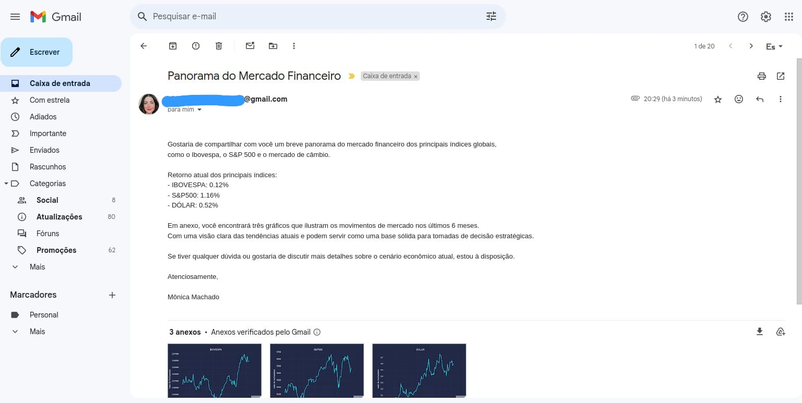

# 📊 Projeto de Análise de Dados Financeiros

Este projeto realiza a análise de dados financeiros de importantes índices e ativos, como o Índice Bovespa (IBOV), o S&P 500 e a taxa de câmbio BRL/USD. 

> O objetivo principal é coletar, visualizar e enviar mensalmente por e-mail relatórios com o desempenho desses ativos.

## 🔍 Descrição do Projeto
O projeto utiliza a biblioteca **Yahoo Finance** para obter dados diários dos índices financeiros e cria gráficos para ilustrar o desempenho de cada ativo ao longo de um período de 6 meses.

Após a criação dos gráficos, eles são automaticamente enviados por email para o destinatário especificado. Esse envio ocorre com um relatório anexado, tornando o processo automatizado e fácil de gerenciar.

## 🔧 Funcionalidades
- **Coleta de dados financeiros** de índices e ativos como IBOV, S&P 500 e BRL/USD.
- **Criação de gráficos** detalhados do desempenho de cada ativo ao longo do semestre.
- **Envio automatizado de relatórios por email** com gráficos anexados para um destinatário pré-definido.

## 📂 As principais bibliotecas usadas neste projeto incluem:
- **Python 3.x**
- **Yahoo Finance API (yfinance)**: Para obter dados financeiros.
- **Pandas**: Para manipulação de dados.
- **Matplotlib e mplcyberpunk**: Para visualização de dados e geração de gráficos estilizados.
- **Smtplib**: Para o envio de emails com relatórios anexados.

Você também pode instalá-las individualmente:
```
pip install yfinance pandas matplotlib mplcyberpunk
```

## 📊 Fontes de Dados
O projeto coleta os seguintes dados:

1. **IBOV (Índice Bovespa)**: Desempenho do mercado de ações brasileiro.
2. **S&P 500**: Um dos principais índices de ações dos Estados Unidos.
3. **BRL/USD**: Cotação do câmbio Real/US Dollar.

Esses dados são coletados diretamente do Yahoo Finance por meio da biblioteca `yfinance` em um intervalo de 6 meses e processados para gerar gráficos que mostram as flutuações de preço ao longo do semestre.

## ✉️ Relatório por Email
Ao final do processo, o projeto envia automaticamente um email contendo os gráficos gerados como anexos. O relatório é enviado utilizando a biblioteca `smtplib`, e você pode configurar o destinatário e outros parâmetros diretamente no código.

Exemplo de email enviado:

- Assunto: Panorama do Mercado Financeiro
- Corpo do email: "Segue em anexo o relatório financeiro."
- Anexos: Gráficos de desempenho de IBOV, S&P 500 e BRL/USD.



## 📈 Exemplo de Gráficos
O projeto gera gráficos com o estilo `cyberpunk` para representar o desempenho dos índices e ativos de forma visualmente atraente.

Exemplos de gráficos gerados:

- Gráfico do Índice Bovespa (IBOV)
- Gráfico do S&P 500
- Gráfico da taxa de câmbio BRL/USD


## 🚀 Como Executar o Projeto
1. Clone o repositório:

~~~
git clone https://github.com/seu-usuario/projeto-analise-de-dados-financeiro.git
cd projeto-analise-de-dados-financeiro
~~~

2.  Executar o Jupyter Notebook:

Inicie o Jupyter Notebook e abra o arquivo para explorar a análise e visualizações dos dados.
```bash

jupyter notebook projeto-email.ipynb

```
Para agendar a execução mensal do script, utilize o Cron (em Linux/macOS) ou o Agendador de Tarefas (em Windows).

## 📧 Configuração do Email (Gmail, Outlook, Apple Mail)
Dependendo do serviço de email que você está usando, configure os parâmetros de email como descrito abaixo.

- Servidor SMTP
- Porta
- Usuário (seu email)
- Senha
- Destinatário do email

**Exemplo:**

```
servidor = "smtp.seuprovedor.com"
porta = 587
usuario = "seuemail@dominio.com"
senha = "suasenha"
destinatario = "destinatario@dominio.com"
```
Certifique-se de alterar essas configurações para garantir que o email seja enviado corretamente.

> [!IMPORTANT]
> Se você ativou a autenticação em dois fatores na sua conta do **Outlook** ou **iCloud**, é necessário gerar uma senha de aplicativo para usar no script, assim como no **Gmail**. Sem isso, o script não conseguirá autenticar.

## 📅 Agendamento Automático
Este projeto pode ser configurado para rodar automaticamente uma vez por mês utilizando:

- Cron (Linux/macOS): Crie uma tarefa agendada que execute o script Python uma vez por mês.
- Task Scheduler (Windows): Configure o Agendador de Tarefas para rodar o script mensalmente.

## 🤝 Contribuições

Sinta-se à vontade para fazer fork deste repositório, enviar issues ou fazer pull requests caso deseje melhorar ou expandir o projeto!
